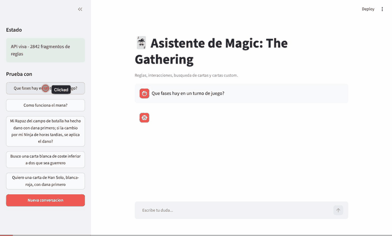
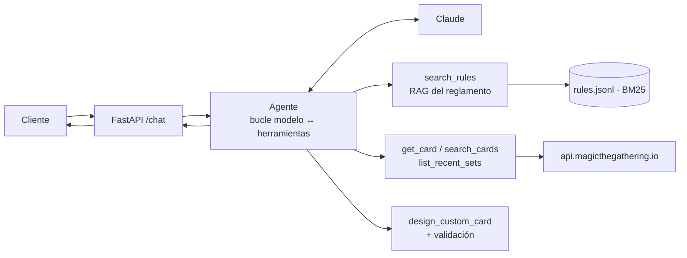

# Ejercicio 1 — Asistente de Magic: The Gathering

Chatbot para el call center de una tienda de Magic. Resuelve dudas de reglas,
razona sobre interacciones entre cartas, busca cartas por descripción y diseña
cartas custom — **citando siempre la regla o la carta en la que se apoya**.

- 📐 **[Solución productiva completa](docs/01-arquitectura-produccion.md)** — servicios, tipos de agente, monitorización y diagramas (Apartado 1).
- 🧭 **[Decisiones técnicas](docs/02-decisiones-tecnicas.md)** — qué se descartó y por qué.

---

## Lo que hace

| Requisito del cliente | Cómo se resuelve |
|---|---|
| Reglas básicas del juego | RAG léxico sobre el reglamento, citando el número de regla |
| Interacciones entre cartas | `get_card` (texto real de cada carta) + `search_rules` en el mismo turno |
| Búsqueda por descripción | Traducción de la descripción a filtros de la API pública de cartas |
| Ver la carta, no solo leerla | La UI pinta el arte de las cartas citadas, descargándolo solo de hosts en lista blanca |
| Carta custom *(bonus)* | Generación + validación determinista contra el reglamento |

En todos los casos la respuesta viene acompañada de **citas** y de una **traza**
de las herramientas usadas. Si el reglamento no respalda una respuesta, el
asistente lo dice y ofrece escalar a un juez, en lugar de inventarse la regla.

---

## La demo, funcionando



Grabado contra **Bedrock real** (Haiku 4.5, `eu-west-1`) con el reglamento
completo indexado —2.842 fragmentos—, no contra dobles de test. En orden:

1. **Reglas.** "¿Qué fases hay en un turno?" → las cinco fases, citando la
   `regla 500.1`.
2. **Interacción entre cartas.** El asistente **se niega** a razonar sobre
   "Rapaz del campo de batalla" y "Ninja de horas tardías" porque no casan con
   ninguna carta real, y pide los nombres en inglés. Al dárselos, mantiene el
   hilo, lee el texto real de ambas y responde citando la `regla 510.2`. Esa
   negativa es el comportamiento buscado, no un fallo: antes inventarse nada,
   preguntar.
3. **Búsqueda por descripción.** "Carta blanca de coste inferior a dos que sea
   guerrero" → cinco cartas con su arte, y la traducción a filtros a la vista:
   `cmc_max=1`, que es la lectura correcta de "inferior a dos".
4. **Carta custom.** Diseño validado contra el reglamento: notación del coste,
   coherencia de colores, fuerza/resistencia y respaldo de la palabra clave en
   la `regla 510.4`.

> El turno 4 usa un prompt explícito con el coste y el tipo. El ejemplo de la
> barra lateral (*"Quiero una carta de Han Solo, blanca-roja, con dana
> primero"*) no basta con Haiku 4.5: el modelo pide antes el coste de maná y la
> línea de tipo en vez de llamar a `design_custom_card`. Es correcto por
> prudente, pero hace falta un turno más para ver el bonus.

---

## Arranque rápido

```bash
cd ejercicio-1-mtg
python -m venv .venv && source .venv/bin/activate
pip install -e ".[dev,ingest]"

# 1. Indexa el reglamento (PDF o TXT)
cp /ruta/al/reglamento.pdf data/raw/
python -m mtg_assistant.rag.ingest data/raw/reglamento.pdf
# -> 2842 fragmentos (2842 con número de regla) -> data/index/rules.jsonl

# 2. Configura las credenciales
cp .env.example .env    # y rellena las credenciales de AWS

# 3. Levanta backend y UI (dos terminales)
uvicorn mtg_assistant.api:app --reload --port 8000
streamlit run src/mtg_assistant/ui.py
```

La UI queda en <http://localhost:8501> y la API en <http://localhost:8000/docs>.

El `.env` se carga solo al arrancar, sin necesidad de exportarlo a mano; lo que
ya venga en el entorno manda sobre el fichero, de modo que en CI o en un
contenedor las variables reales no pueden ser pisadas por un `.env` que se cuele
en la imagen.

> **Si el 8000 está ocupado**, mueve los dos extremos a la vez: la UI habla con
> la API por HTTP y necesita saber dónde está.
>
> ```bash
> uvicorn mtg_assistant.api:app --reload --port 8010
> MTG_API_URL=http://127.0.0.1:8010 streamlit run src/mtg_assistant/ui.py
> ```

> Sin reglamento a mano, `tests/fixtures/reglamento_mini.txt` sirve para probar
> el circuito completo: `python -m mtg_assistant.rag.ingest tests/fixtures/reglamento_mini.txt`.

---

## Cómo funciona



El agente decide qué herramientas llamar y cuántas veces. El código impone los
límites: número máximo de turnos, validación de argumentos y conversión de
cualquier fallo de herramienta en un `tool_result` de error que el modelo puede
leer y corregir.

### Las cinco herramientas

| Herramienta | Qué hace |
|---|---|
| `search_rules` | Recupera fragmentos literales del reglamento con su número de regla |
| `get_card` | Ficha oficial de una carta por nombre |
| `search_cards` | Busca cartas por color, tipo, subtipo, texto y rango de coste |
| `list_recent_sets` | Últimas ediciones publicadas |
| `design_custom_card` | Crea una carta inventada y la valida contra las reglas |

### Ejemplo de respuesta

```json
{
  "conversation_id": "a3f…",
  "answer": "Un turno tiene cinco fases: comienzo, precombate principal, combate,\npostcombate principal y final.\n\nBase: regla 500.1",
  "citations": [{"kind": "rule", "label": "regla 500.1", "detail": "5. Turnos y fases"}],
  "trace": [{"tool": "search_rules", "arguments": {"query": "fases del turno"}, "ok": true,
             "summary": "3 fragmentos para 'fases del turno'"}]
}
```

---

## Estructura

```
config/
  defaults.toml valores por defecto, versionados y comentados
src/mtg_assistant/
  agent/        bucle agéntico y prompt de sistema
  tools/        las cinco herramientas, con su esquema JSON
  rag/          troceado, índice BM25, glosario ES↔EN e ingesta
  clients/      proveedor LLM (Bedrock / Anthropic) y api.magicthegathering.io
  config.py     esquema de Settings y precedencia de fuentes
  factory.py    cableado de dependencias, en un solo sitio
  models.py     contratos Pydantic compartidos
  images.py     lista blanca de hosts para el arte que la UI descarga
  api.py        FastAPI
  ui.py         Streamlit
scripts/        ingesta, evaluación del RAG y prueba de humo
tests/          149 tests, sin red ni claves
```

---

## Tests

```bash
pytest                                        # 149 (2 se saltan sin índice construido)
pytest --cov=mtg_assistant --cov-report=term  # 87 % (94 % sin contar la UI)
ruff check src tests scripts
```

La suite es **hermética**: el cliente de Claude y la API de cartas se sustituyen
por dobles (`tests/conftest.py`), así que corre en CI sin secretos ni red. Cubre
el troceado y el ranking del RAG, la traducción de filtros a la API, los caminos
de fallo del agente (herramienta inexistente, argumentos inválidos, límite de
turnos, rechazo del modelo), la memoria de conversación, la forma de la petición
según el modelo, el filtro de hosts del arte de las cartas y el contrato HTTP.

### Calidad de la recuperación

Ajustar un RAG a ojo no es ajustarlo. Hay un mini golden set de 16 preguntas con
las reglas que *deberían* citarse
([`tests/fixtures/golden_set.json`](tests/fixtures/golden_set.json)) y un script
que mide `recall@k` sobre él:

```bash
python scripts/eval_retrieval.py
# recall@3: 38%   recall@6: 62%   recall@10: 69%
```

Esa medición es la que guió las dos correcciones sobre BM25 puro —peso del
título de sección y prior de la regla general frente a sus sub-reglas—, que
subieron el `recall@6` **del 38 % al 62 %** sobre las *Comprehensive Rules*. El
resto de la distancia es exactamente lo que justifica el paso a recuperación
híbrida con re-ranker descrito en el documento de arquitectura.

`tests/test_retrieval_quality.py` convierte esa métrica en una puerta: se salta
si no hay índice construido (el reglamento no se versiona por copyright) y falla
si el `recall@6` baja del 55 %.

### Verificación en vivo

Los tests son herméticos por diseño, así que no prueban que el sistema real
funcione. Eso se comprueba aparte, con el reglamento completo indexado (2.842
fragmentos) contra Bedrock `eu-west-1` con Haiku 4.5:

```bash
python scripts/smoke.py
```

Lanza las cinco consultas del enunciado sobre la misma conversación —así se ve
de paso que mantiene el hilo— e imprime la traza de herramientas de cada turno.
Los cuatro requisitos responden y citan. Un ejemplo de lo que hay que mirar en la
traza: "carta blanca de coste inferior a dos que sea guerrero" se traduce a

```json
{"colors": ["W"], "cmc_max": 1, "types": ["Creature"], "subtypes": ["Warrior"]}
```

`cmc_max: 1`, no `2` — que es la lectura correcta de "inferior a dos", y la clase
de error que una demo no verificada se lleva puesta.

> Cada mensaje gasta tokens reales. Haiku 4.5 cuesta aproximadamente la mitad que
> Sonnet 5, pero no es gratis.

---

## Proveedor del modelo

Por defecto el asistente habla con **Claude en Amazon Bedrock**, a través del
perfil de inferencia `eu.`: la inferencia se queda dentro de la UE y el
encargado del tratamiento es AWS, no Anthropic. Es una decisión legal además de
técnica.

El proveedor, la región y el modelo son **configuración versionada**, no algo
que cada uno lleve en su `.env`: viven en
[`config/defaults.toml`](config/defaults.toml) con el porqué de cada valor al
lado.

```toml
llm_provider = "bedrock"
aws_region = "eu-west-1"
bedrock_model = "eu.anthropic.claude-haiku-4-5-20251001-v1:0"
```

En el `.env` van solo las credenciales, y cualquier variable puntual que quieras
probar sin tocar la configuración del proyecto:

```bash
# Solo si te autenticas con claves. Con perfil, SSO o rol de instancia deja
# estas dos comentadas: definirlas gana a la cadena de credenciales de AWS.
# AWS_ACCESS_KEY_ID=
# AWS_SECRET_ACCESS_KEY=
```

Las tres partes del id de modelo son necesarias: `eu.` (perfil europeo, sin él
la llamada falla), `anthropic.` (prefijo de plataforma) y la forma **datada**
`-20251001-v1:0` (el id sin fecha solo existe en el endpoint Mantle, que no
sirve Haiku 4.5).

Para usar la API de primera parte basta cambiar dos variables:

```bash
LLM_PROVIDER=anthropic
ANTHROPIC_API_KEY=sk-ant-...
```

**La forma de la petición se ajusta sola al modelo.** Haiku 4.5 devuelve un 400
si recibe `thinking` adaptativo o `output_config.effort`; Sonnet 5 y la familia
Opus 4.6+ los aprovechan. `capabilities_for()` lo deriva del id del modelo, no
del proveedor, así que apuntar `MTG_MODEL` a otro modelo no requiere tocar
código. Hay tests que fijan ambos casos.

Las credenciales se resuelven **solo en el backend**, desde el entorno; nunca
llegan a la UI ni viajan en el código. Las credenciales y los ajustes de tu
máquina están en [`.env.example`](.env.example); todo lo demás, en
[`config/defaults.toml`](config/defaults.toml).
