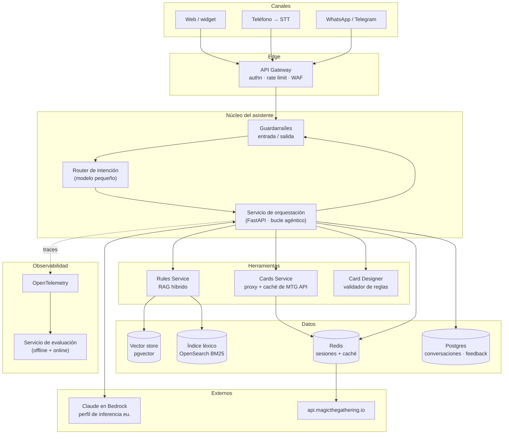
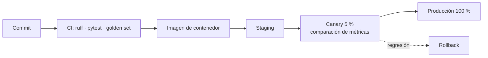

# Arquitectura de la solución productiva

Asistente conversacional para el call center de Magic: The Gathering.
Este documento describe el sistema **completo en producción**; la demo de este
repositorio implementa el núcleo (agente, herramientas, RAG, API, UI) y deja
explícito lo que faltaría por añadir.

---

## 1. Qué problema resuelve y con qué SLA

| Caso de uso | Volumen esperado | Latencia objetivo | Coste por consulta |
|---|---|---|---|
| Reglas básicas ("¿qué fases hay?") | ~60 % del tráfico | < 3 s | bajo (1 herramienta) |
| Interacciones entre cartas | ~25 % | < 8 s | medio (2-4 herramientas) |
| Búsqueda de cartas | ~12 % | < 5 s | medio |
| Carta custom (bonus) | ~3 % | < 15 s | alto |

Métricas de negocio que se persiguen: **tasa de resolución sin agente humano**,
**tasa de escalado a juez** y **consultas respondidas sin cita** (que debe
tender a cero — ver §6).

---

## 2. Vista general

---

## 3. Servicios

### 3.1 API Gateway
Autenticación del canal, *rate limiting* por cliente, WAF y terminación TLS.
Nada de lógica de negocio. Aísla al núcleo de la variedad de canales.

### 3.2 Guardarraíles (entrada y salida)
- **Entrada**: detección de prompt injection, PII y consultas fuera de dominio.
  Una pregunta que no va de Magic se corta aquí, no gastando una llamada al LLM.
- **Salida**: verificación de que la respuesta **contiene al menos una cita**
  cuando el turno ha afirmado una regla. Sin cita → se reintenta una vez con una
  instrucción reforzada; si vuelve a fallar, se escala a humano.
  Este es el guardarraíl más importante del sistema: convierte "el bot alucina"
  en "el bot escala".
- **Egreso**: toda URL que el sistema vaya a *pedir* por venir de una respuesta
  de terceros —el arte de una carta es el caso de la demo— pasa por una lista
  blanca de hosts y de esquemas. Si no, un `imageUrl` manipulado convierte al
  renderizador en el cliente de una petición interna (SSRF). En la demo esto
  vive en `images.py`; en producción es una política del egress proxy, para que
  no dependa de que cada canal se acuerde.

### 3.3 Router de intención
Clasificador barato (Claude Haiku 4.5 o un clasificador propio) que etiqueta el
turno en `regla_basica | interaccion | busqueda_carta | diseno_carta | fuera_de_dominio`.
Sirve para tres cosas:

1. **Elegir modelo y esfuerzo**: `regla_basica` va a Sonnet 5 con `effort: low`;
   `interaccion` a Opus 5 con `effort: high`. La diferencia de coste es de un
   orden de magnitud y la calidad no se resiente donde no hace falta.
2. **Recortar el catálogo de herramientas** expuesto al modelo, lo que reduce
   tokens de entrada y llamadas erróneas.
3. **Enrutar a humano** directamente cuando aplica (reclamaciones, pedidos).

### 3.4 Servicio de orquestación
El corazón: mantiene el bucle `modelo → herramientas → modelo`, la memoria de
conversación y la traza. Es el código de `src/mtg_assistant/agent/` de la demo,
desplegado como servicio *stateless* detrás de un balanceador (el estado vive en
Redis, no en el proceso).

### 3.5 Rules Service (RAG del reglamento)
Recuperación **híbrida**: BM25 + embeddings, fusionados con *Reciprocal Rank
Fusion*, y un re-ranker cross-encoder sobre el top-30.

- **Por qué híbrido**: el vocabulario de Magic es muy técnico y los números de
  regla ("702.7b") son literales que lo léxico acierta siempre y lo denso falla.
  A la vez, el cliente describe las situaciones con sus palabras, y ahí lo denso
  gana. Cada mitad cubre el punto ciego de la otra.
- **Unidad de indexación**: la regla numerada, porque es también la unidad de
  cita que el cliente puede verificar.
- **Reindexado**: los reglamentos se actualizan con cada edición. Pipeline
  versionado: un índice nuevo se construye en paralelo, pasa el *golden set* de
  §6 y solo entonces se promueve con un cambio de alias. Rollback = volver el alias.

### 3.6 Cards Service
Proxy sobre `api.magicthegathering.io` con:
- **Caché** en Redis. Las cartas son prácticamente inmutables: TTL de 24 h para
  fichas, 1 h para listas de ediciones. Recorta latencia y protege del límite de
  5.000 req/h de la API pública.
- **Circuit breaker**: si la API cae, se responde desde caché marcando la
  respuesta como "posiblemente desactualizada" en lugar de fallar el turno.
- **Traducción de filtros** ES→EN y los filtros que la API no soporta (rangos de
  coste convertido), ya implementados en la demo.
- A medio plazo, una **réplica local** del catálogo (un volcado diario a
  Postgres) elimina la dependencia dura de un tercero gratuito.

### 3.7 Card Designer
Genera la carta y la **valida** contra reglas duras: notación del coste,
coherencia color/coste, fuerza-resistencia solo en criaturas, existencia real de
cada palabra clave en el reglamento. La validación es determinista y va en
código, no en el prompt.

---

## 4. Tipos de agente

Se usa una **arquitectura de un solo agente con herramientas**, no un enjambre
multiagente. Es una decisión deliberada:

| Opción | Por qué **no** aquí |
|---|---|
| Un agente por dominio + supervisor | Añade un salto de LLM (latencia y coste) para un dominio que cabe en un catálogo de 5 herramientas. |
| Grafo de estados rígido | Las interacciones entre cartas no tienen un flujo fijo: el número de consultas depende de cuántas cartas mencione el cliente. |
| **Un agente + herramientas** ✅ | El modelo decide cuántas veces consultar; el código impone los límites (nº de turnos, presupuesto, guardarraíles). |

Dentro de ese agente hay **tres roles diferenciados**, que se corresponden con
tres configuraciones de llamada distintas. **Esto es el diseño productivo: la
demo corre con un solo modelo**, el que indique `MTG_MODEL`, porque no lleva
router de intención (§10).

| Rol | Modelo | Esfuerzo | Herramientas | Cuándo |
|---|---|---|---|---|
| **Clasificador** | Haiku 4.5 | — | ninguna | Todo turno entrante |
| **Respondedor** | Sonnet 5 | `low` | `search_rules`, `search_cards`, `list_recent_sets` | Reglas básicas y búsquedas |
| **Razonador** | Opus 5 | `high` | catálogo completo | Interacciones y diseño de cartas |

`effort` solo existe de la familia 4.6 en adelante: Haiku 4.5 devuelve un 400 si
lo recibe, y lo mismo con `thinking` adaptativo. La demo ya deriva esas
capacidades del id del modelo (`capabilities_for()`), que es justo lo que hace
viable esta tabla — cada rol apunta a un modelo distinto sin ramas por proveedor
repartidas por el código.

El escalado entre respondedor y razonador es automático: si el respondedor
termina sin cita, o si el guardarraíl de salida lo rechaza, el turno se reintenta
con el razonador antes de escalar a humano.

**Herramientas, no prompt gigante.** Meter el reglamento entero en el contexto
sería más simple, pero pierde la cita exacta (el modelo parafrasea el documento
completo) y hace imposible razonar sobre qué fragmento sostuvo la respuesta —
justo lo que el cliente pide justificar.

---

## 5. Estado y memoria

| Dato | Dónde | TTL | Por qué |
|---|---|---|---|
| Historial del turno en curso | Redis | 30 min | El orquestador es *stateless*; cualquier réplica atiende el siguiente turno |
| Conversación cerrada | Postgres | retención legal | Auditoría, analítica y material para evaluar |
| Resumen de conversación larga | Redis | 30 min | Cuando el historial supera ~40 mensajes se compacta en lugar de truncar |
| Caché de cartas | Redis | 1-24 h | Latencia y límite de la API pública |
| Índices de reglas | pgvector + OpenSearch | versionado por edición | Reindexado sin downtime vía alias |

**Caché de prompts.** El orden de renderizado es `tools → system → messages`, así
que el prompt de sistema y el catálogo de herramientas se mantienen **byte a byte
estables** y se marcan con `cache_control`. Nada de fechas ni IDs en esa parte:
un solo carácter variable invalida el prefijo y multiplica la factura. Se vigila
con `usage.cache_read_input_tokens`; si cae a cero de forma sostenida, hay una
regresión.

---

## 6. Evaluación y calidad

Sin evaluación, cualquier cambio de prompt es una apuesta. Tres niveles:

**Golden set (offline, en CI).** 150-300 preguntas reales del call center con su
respuesta y, sobre todo, **las reglas que deberían citarse**. La demo ya trae la
versión mínima de esto —16 preguntas en `tests/fixtures/golden_set.json` y
`scripts/eval_retrieval.py`— y fue lo que permitió subir el `recall@6` del 38 %
al 62 % con dos cambios, en lugar de ajustar el RAG a ojo. Se mide:

- `citation_recall`: ¿aparece la regla correcta entre las recuperadas? Es la
  métrica que aísla fallos del RAG de fallos del modelo.
- `citation_precision`: ¿cita reglas que no vienen a cuento?
- `answer_correctness`: juez LLM con rúbrica, calibrado contra un subconjunto
  etiquetado a mano.
- `abstention_rate`: ¿se calla cuando debería? Un sistema que nunca dice "no lo
  sé" es peor que uno que lo dice demasiado.

Ninguna versión de prompt o de índice se promueve sin superar la anterior en
`citation_recall` sin empeorar `abstention_rate`.

**Online.** Pulgar arriba/abajo en la UI, tasa de escalado a humano y tasa de
reapertura de la misma consulta por el mismo cliente en 24 h (señal de respuesta
insuficiente). El feedback negativo alimenta el golden set.

**Shadow mode.** Antes de exponer el bot, se ejecuta en paralelo a los agentes
humanos durante unas semanas, sin responder al cliente, comparando su respuesta
con la del humano. Es la forma barata de medir la tasa de resolución real.

---

## 7. Observabilidad

**Trazas (OpenTelemetry).** Cada turno es un *span* raíz con hijos por llamada al
LLM y por herramienta. Atributos por span: modelo, `effort`, tokens de
entrada/salida, tokens leídos de caché, latencia, nombre de herramienta,
resultado (ok/error), número de fragmentos recuperados y su score máximo.

**Métricas y alertas.**

| Métrica | Alerta |
|---|---|
| `p95` de latencia por intención | > 2× el objetivo de §1, 10 min |
| Coste por conversación | desviación > 30 % sobre la media semanal |
| `cache_read_input_tokens / input_tokens` | < 0,3 sostenido (regresión de caché) |
| Turnos sin cita | > 2 % |
| Escalados a humano | subida > 50 % día sobre día |
| Errores 5xx de la API de cartas | > 5 % en 5 min → circuit breaker |
| Turnos que agotan el límite de herramientas | > 1 % (bucle del agente) |

**Logs.** Estructurados en JSON, con `conversation_id` y `turn_id` correlados a
las trazas. Se registran las **consultas** a las herramientas y los **ids de
fragmento** recuperados, no el texto completo: basta para reproducir un fallo y
no infla el almacenamiento.

**Privacidad.** El texto del cliente puede llevar PII (nombre, pedido): se
redacta antes de persistir y la retención es explícita. Las credenciales del
modelo viven solo en el backend, inyectadas por el gestor de secretos; nunca
llegan al canal ni a la UI.

**Residencia del dato.** La inferencia va contra **Claude en Amazon Bedrock**
con el perfil `eu.`, que reparte entre seis regiones de estados miembro
(IE/DE/SE/FR/IT/ES). Dos consecuencias que conviene tener escritas antes de que
las pregunte el DPO: el encargado del tratamiento es **AWS**, no Anthropic, así
que aplica el DPA de AWS y no el acuerdo de retención cero de Anthropic; y al no
haber destinos fuera de la UE, no hay transferencia del Capítulo V — ni siquiera
por adecuación. La política IAM debe **enumerar** las regiones permitidas en
lugar de usar un comodín, para que una futura región no europea en el perfil
falle en cerrado en vez de transferir en silencio.

---

## 8. Despliegue y operación

- Contenedores en Kubernetes (o Cloud Run); el orquestador escala por
  peticiones concurrentes, no por CPU: está dominado por espera de red.
- **Los prompts se versionan como código** y viajan en la imagen. Un cambio de
  prompt es un despliegue, con su canary y su rollback.
- Presupuesto por conversación (`task_budget`) y límite de turnos de herramienta:
  un agente que se atasca cuesta dinero, y el corte debe ser del código, no de la
  buena voluntad del modelo.
- Degradación ordenada: si cae la API de cartas, el bot sigue resolviendo reglas
  y lo dice; si cae el LLM, el canal cae a cola humana con el contexto ya
  recogido.

---

## 9. Costes (orden de magnitud)

Para 10.000 conversaciones/mes, ~3 turnos por conversación:

| Partida | Estimación |
|---|---|
| Clasificación (Haiku 4.5) | despreciable |
| Respondedor (Sonnet 5, `effort: low`, ~70 % del tráfico) | la partida dominante |
| Razonador (Opus 5, `effort: high`, ~30 %) | comparable a la anterior pese al menor volumen |
| Embeddings (solo al reindexar) | despreciable |
| Infra (Redis, Postgres, OpenSearch, cómputo) | fijo, modesto |

Las tres palancas por orden de retorno: **caché de prompts** (el prefijo estable
es gratis de implementar y recorta la mayor parte del input), **enrutado por
esfuerzo** (no pagar Opus para "¿qué fases hay?") y **caché de cartas**. Solo
después tiene sentido tocar el modelo.

---

## 10. Qué implementa la demo y qué no

| Componente | Demo | Producción |
|---|---|---|
| Bucle agéntico con herramientas | ✅ | ✅ |
| Claude en Bedrock, perfil `eu.` | ✅ | ✅ |
| Petición ajustada a las capacidades del modelo | ✅ | ✅ |
| RAG del reglamento con citas | ✅ BM25 + glosario ES↔EN | híbrido + re-ranker |
| Cliente de la API de cartas | ✅ con filtros en cliente | + caché y circuit breaker |
| Carta custom validada | ✅ | ✅ |
| Memoria de conversación | ✅ en proceso | Redis + compactación |
| API HTTP + UI | ✅ FastAPI + Streamlit | + gateway y canales reales |
| Router de intención | ❌ (la selección de modelo es una variable de entorno) | ✅ |
| Guardarraíles | parcial (el prompt y las herramientas empujan a citar) | servicio dedicado |
| Observabilidad | logs estructurados + traza por turno en la respuesta | OTel + dashboards |
| Evaluación | golden set de 16 preguntas + `recall@k` como puerta | 150-300 preguntas en CI + métricas online |
