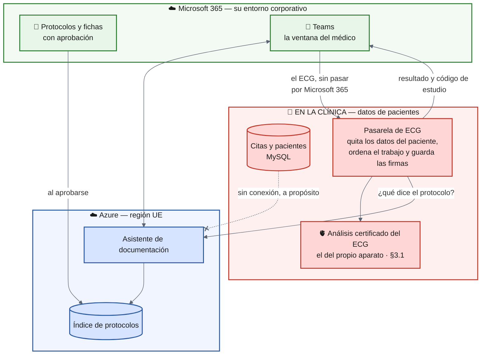
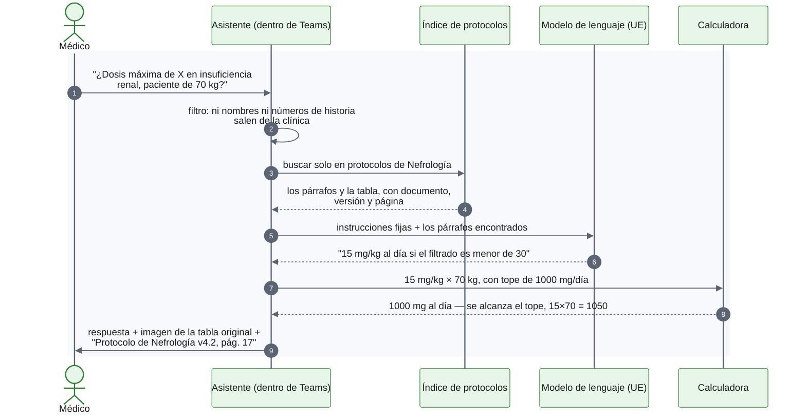
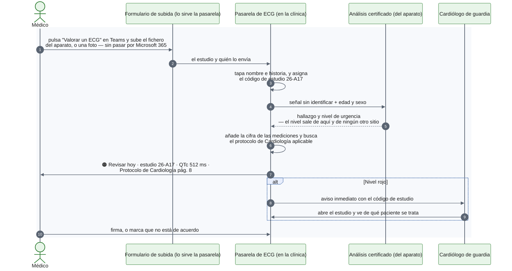

# Apartado 3 — Propuesta de solución

**Asistente de consulta clínica interna** Clínica privada · ~80 profesionales
~80 documentos clínicos entre protocolos en PDF y fichas de medicamento en Word
Un equipo de IT de una persona, sin experiencia en Python

## 1. Resumen ejecutivo

Se proponen **dos servicios** que comparten interfaz y mantenimiento, pero que
viven separados: uno trabaja con documentos, el otro con datos de pacientes.

**A — Asistente de documentación clínica.** El médico pregunta con sus palabras,
y el asistente responde diciendo siempre **de qué protocolo lo ha sacado, de qué
versión y de qué página**. Al lado enseña la tabla original. Si hay que ajustar
una dosis al peso, la cuenta la hace una **calculadora**, no el asistente.

Este servicio **no ve pacientes**. Trabaja sobre protocolos y fichas de
medicamento. Tampoco tiene acceso a la base de citas: no es que esté protegida,
es que no hay camino hasta ella. Antes de publicar un documento, **una persona
valida que las tablas se hayan leído bien** — son 80, y cambian dos a cuatro
veces al año. Una fila mal leída puede dañar al paciente.

**B — Valoración inicial de electrocardiogramas.** El médico sube un ECG y
recibe los **hallazgos de riesgo evidentes** y un **nivel de urgencia** en
cuatro niveles, con **lo que dice el protocolo de la clínica para ese
hallazgo**. Es una pre-lectura que ordena la cola, no un informe: la firma el
facultativo, siempre.

La lectura del trazado **no la hace un modelo de lenguaje**. La hace el análisis
certificado del propio electrocardiógrafo — un producto sanitario, que es lo que
pide la normativa europea, y que la clínica es muy posible que ya esté pagando.
Nosotros enlazamos ese hallazgo con el protocolo y lo ponemos en Teams. El nivel
de urgencia lo fija el aparato, no lo reescribimos.

Ambos se abren desde **Teams** —o desde el navegador—, con el usuario
corporativo. No hay que instalar nada en 80 ordenadores, y **no hay servidores
que su persona de IT tenga que mantener**: el servicio A corre en Azure, en
Europa, sobre Microsoft 365. El ECG añade un equipo cerrado en la clínica,
que se actualiza solo.

Lo de *"un modelo especializado por especialidad"* se hace **sin entrenar
ningún modelo**: cada documento lleva su etiqueta y la búsqueda prioriza lo que
toca. Entrenar uno por servicio sería más caro y más difícil de mantener.

---

## 2. Arquitectura propuesta

### 2.1 Visión conjunta

Lo importante del dibujo son las dos cajas rojas y lo poco que las cruza. **Los
datos de pacientes se quedan dentro de la clínica.** Lo que sube a Azure son
protocolos y fichas de medicamento, que son documentos corporativos.

Dicho pieza por pieza, y con el motivo al lado:

| Dónde vive | Qué | Por qué ahí |
|---|---|---|
| **Solo en la clínica** | Citas y pacientes (MySQL), los trazados de ECG, la correspondencia entre el código de estudio y el paciente, y cada valoración firmada | Son datos de salud de personas concretas. El asistente de documentación no tiene credenciales, ni ruta de red, ni motivo para llegar a ellos. A Teams sale el resultado con su código de estudio, nunca el trazado ni el nombre. |
| **Microsoft 365** | Los documentos originales, la conversación en Teams y la identidad de los usuarios | Bajo su propio contrato con Microsoft. No añadimos un sitio nuevo donde guardar cosas. |
| **Azure, región UE** | La copia indexada de los protocolos, el índice de búsqueda, el asistente y el registro de consultas | No son datos de pacientes. Contrato de tratamiento con Microsoft, residencia en la UE y **sin uso de lo que enviamos para entrenar modelos**. |
| **Fuera, solo si se contrata** | La señal del ECG **sin ningún identificador**, más edad y sexo | Con la opción recomendada —el análisis que ya hace el electrocardiógrafo— **esta fila no llega a existir: no sale nada**. Solo aplica si más adelante se contrata un motor externo (§3.1). |
| **Nunca hacia Azure** | Nombres de pacientes, números de historia, teléfonos | Un filtro revisa cada pregunta antes de que salga hacia el modelo. Lo que el médico **teclea** en Teams queda en Teams aunque el filtro lo corte después: por eso el chat tiene retención corta. |

### 2.2 Cómo fluye una pregunta sobre un protocolo

Así se ve por dentro la consulta más corriente: una duda de dosis, de las que
hoy se resuelven preguntando al compañero.

Tres detalles del recorrido que conviene explicar aparte:

- **El filtro del paso 3** revisa la pregunta antes de que salga hacia el
  modelo. El médico escribirá cosas como *"paciente de 78 años"* —que es
  contexto clínico, no identificación—, pero también puede pegar un nombre sin
  pensarlo.
- **La calculadora entra después del modelo, no dentro.** El modelo determina
  qué fórmula toca según el protocolo; la cuenta la hace la calculadora. La
  diferencia entre 1050 y el tope de 1000 es justo el detalle que se le escapa a
  un modelo.
- **La referencia incluye versión y fecha.** Un protocolo de 2024 y su revisión
  de 2026 se llaman igual.

### 2.3 Cómo fluye un electrocardiograma

El segundo servicio recorre un camino distinto, y por una razón de fondo: aquí
sí hay un paciente identificable, así que nada de esto sale de la clínica.

El fichero no se adjunta al chat: un ECG lleva el nombre impreso, y Teams lo
guardaría en Microsoft 365. El botón abre un formulario que sirve la pasarela;
el fichero va directo a la clínica. La pasarela tapa nombre e historia y **le
enseña al médico el trazado ya tapado** antes de seguir. Si queda algo a la
vista, no se envía. El código de estudio (*26-A17*) es lo único que cruza a
Teams: con él, un facultativo autorizado abre el estudio dentro de la clínica.

Tres reglas: el nivel de urgencia lo pone el producto certificado, y nadie más
(§3.1). No existe el resultado "ECG normal"; el verde dice "sin hallazgos del
catálogo". Un aviso rojo que nadie abre se relanza, y si la pasarela no
responde el ECG se lleva a cardiología a mano, como hoy.

---
## 3. Decisiones tecnológicas clave

Seis decisiones, con lo que pesa en cada una el hecho de ser esta clínica y no
otra:

| Componente | Elección | Por qué para este cliente |
|---|---|---|
| **Modelo LLM** | **Cloud gestionado**: Azure AI Foundry en región europea, con el modelo cambiable por configuración | Como los datos de pacientes no entran, solo salen preguntas y párrafos de protocolo. Un modelo instalado en la clínica exigiría tarjetas gráficas y ajuste continuo: imposible con una persona de IT que no programa. |
| **Base de datos vectorial** | **Azure AI Search**, con búsqueda combinada: por significado y por palabra exacta | No hay servidor que instalar, respaldar ni actualizar. La palabra exacta importa aquí más de lo normal: los médicos escriben nombres de fármaco y códigos que la búsqueda por significado difumina. |
| **Indexar las tablas de dosificación** | Lectura que **respeta la disposición de la página** (Azure Document Intelligence): **cada tabla entera y sin partir**, **validada por una persona** antes de publicarse | Si se trocea el documento por tamaño, la tabla se parte y quedan filas sin cabecera: el sistema daría la dosis pediátrica para un adulto sin que nada lo indique. La validación se concentra en los PDF. |
| **Imágenes clínicas de los PDF** | Se extraen, se guardan y **se enseñan** junto a la referencia; **no se interpretan**. De cada tabla se guarda su recorte | Una imagen le sirve al médico mirándola, no descrita por un modelo. Que el sistema afirme algo sobre una imagen clínica es mucho riesgo y ninguna ventaja frente a mostrarla. |
| **Herramienta para cálculos** | Una **calculadora programada** (Azure Functions), con unidades y topes en **una tabla que se edita en Excel**. El asistente la llama, pero no calcula | Un modelo acierta casi todas las cuentas y falla algunas sin avisar de cuáles. Para una dosis eso no vale. Y con los topes en un Excel, **farmacia los actualiza sin que intervenga IT**. |
| **Interfaz de usuario** | **Microsoft Teams** si trabajan con Microsoft 365; si no, la misma configuración publica una **página web**. En los dos casos, el usuario corporativo | Cero instalación y cero contraseñas nuevas por cualquiera de las dos vías. Con Teams se gana que el médico ya lo tiene abierto en consulta y en el móvil. |

> **El módulo de ECG** añade dos piezas sobre esta base: una **pasarela dentro de la
> clínica**, que quita los datos del paciente y ordena el trabajo, y el **análisis
> certificado** que decide el nivel de urgencia (§3.1). El enlace hallazgo→protocolo
> lo hace el mismo asistente de la tabla, consultando siempre el perfil de
> Cardiología sea quien sea el solicitante.

### 3.1 El ECG: qué se compra y por qué esa frontera

**Qué acepta.** El fichero que exporta el electrocardiógrafo, porque trae la
señal y las mediciones ya calculadas. Una foto del trazado también se acepta,
pero **encola y avisa; no valora**, salvo que el producto elegido tenga la
imagen dentro de su certificación.

**Catálogo cerrado**, acordado y firmado con cardiología antes de construir
nada:

| Nivel | Qué significa | Ejemplos |
|---|---|---|
| 🔴 **Rojo — ahora** | Aviso inmediato al cardiólogo de guardia | Infarto con elevación del ST · taquicardia ventricular · bloqueo AV completo |
| 🟠 **Naranja — hoy** | Revisar antes de que acabe la jornada | Fibrilación auricular de novo con respuesta rápida · QTc > 500 ms |
| 🟡 **Amarillo — en consulta** | Probablemente crónico, conviene mirarlo | Signos de hipertrofia · alteraciones de la repolarización |
| 🟢 **Verde** | **No dice que el ECG sea normal.** Solo que no ha encontrado nada de la lista | — |

**De dónde sale el análisis.** Se arranca **reutilizando el del propio
electrocardiógrafo**. La pasarela traduce lo que dice al catálogo firmado y
publica la tarjeta: no sale ningún dato y no hay licencia nueva. A cambio ve
menos que un motor de IA moderno: sólido en lo evidente —el alcance prometido—
y ciego ante lo sutil. **Contratar un motor certificado queda como mejora
posterior**, medida contra los ECG de la propia clínica.

**Por qué nuestras reglas no pueden elevar el nivel.** Combinar el análisis
certificado con nuestras reglas y quedarnos con lo más grave suena prudente.
Pero un software que modifica la salida de un producto certificado para producir
una valoración nueva es, en la UE, un producto distinto — y uno sin marcado CE.
Se perdería exactamente aquello por lo que se usa. Las reglas muestran la cifra
y piden lectura humana; no tocan el nivel. Si no cuadran, el estudio se marca
como *contraste dudoso* y pasa a lectura por cardiólogo: escala el proceso, no
el resultado. Si cardiología quiere el escalado automático, convierte a la
clínica en fabricante (artículo 5.5 del Reglamento (UE) 2017/745) y hay que
presupuestarlo como el proyecto de calidad que es.

### 3.2 Lo que cuesta y quién lo mantiene

La restricción de verdad del encargo es *"mantenible por una persona de IT sin
experiencia en Python"*. La respuesta corta: **esa persona no mantiene el
sistema, lo administra.** Lo esencial cabe en estas dos tablas.

| Frecuencia | Tarea | Cómo se hace |
|---|---|---|
| Cuando cambia un protocolo | Publicar la versión nueva | Farmacia lo sube a SharePoint y lo aprueba. Se indexa solo. **IT no interviene** |
| Cuando cardiología cambia un umbral | Publicar la tabla nueva | La edita y la firma cardiología. **IT no interviene** |
| Al incorporarse un médico | Darle acceso | Añadirlo a su grupo, como con cualquier otra aplicación |
| Mensual | Mirar el panel | Consultas, preguntas sin respuesta, ECG, correcciones, coste. Cinco minutos |
| Cuando salte una alerta | Seguir el manual | Cinco escenarios, con captura y a quién llamar |
| **Nunca** | Parchear servidores, renovar certificados, copias de seguridad, actualizar librerías, tocar código, ajustar modelos | No existen esas tareas en este diseño |

| Coste recurrente — servicio A | Mínimo | Máximo |
|---|---:|---:|
| Búsqueda (Azure AI Search) | 75 € | 250 € |
| Modelo de lenguaje | 50 € | 250 € |
| Reindexado de lo que cambia | 2 € | 15 € |
| Almacenamiento, funciones, registro | 10 € | 30 € |
| Licencias de la ventana en Teams | 0 € | 200 € |
| **Total al mes** | **137 €** | **745 €** |

Para presupuestar, **contar con 400-500 €/mes** y medirlo en el piloto. La
indexación inicial completa son unos 25 € una sola vez. El módulo de ECG añade
el equipo de la pasarela (1.500-3.000 € una vez) y su soporte; arrancando con el
análisis del propio electrocardiógrafo **no añade licencia de motor**, que era
la partida más incierta del proyecto.

Lo que no aparece en estas tablas y es lo que de verdad cuesta: la implantación,
la validación clínica del módulo de ECG y el contrato de soporte. La
infraestructura es barata; validar 80 documentos con tablas de dosis, no.

---
## 4. Lo que el sistema NO hará

Cuatro fronteras que preferimos dejar por escrito ahora. La primera contradice
la letra del encargo, y justo por eso va delante:

**4.1 No habrá un modelo ni un agente distinto por especialidad.** Lo que el
nefrólogo necesita se lo damos con un **perfil**: un único sistema, y lo que
cambia es qué documentos mira primero y qué instrucciones sigue. Añadir una
especialidad es una tarde de la dirección médica, sin IT. El perfil prioriza,
pero no esconde la documentación transversal. Entrenar un modelo por servicio
exigiría datos que la clínica no tiene, habría que revalidarlo cada vez que
cambie un protocolo, y **no podría citar la página de origen**.

**4.2 No consultará datos de pacientes del sistema de citas.** No responderá a
*"¿qué medicación toma el paciente García?"*, porque no tiene acceso a esa
base. Si el asistente pudiera leerla, cada respuesta pasaría a ser un uso de
datos de salud, y cada error del modelo una posible brecha. Ahorrarle al médico
teclear el peso no compensa eso. Si más adelante se quiere, es otro proyecto.

**4.3 El módulo de ECG no lee electrocardiogramas como los lee un cardiólogo.**
Hace la valoración inicial que se pidió, y nada más. **Solo se pronuncia sobre
un catálogo cerrado**: lo que no está en la lista sale como "fuera de alcance",
no como "no hay nada". Por eso **nunca descarta** — el verde significa "sin
hallazgos del catálogo" y jamás "ECG normal". Tampoco sustituye al cardiólogo,
no emite informes ni entra en la historia clínica por su cuenta, y **no sube la
urgencia por su cuenta**. Un sistema que tranquiliza es más peligroso que uno
que no detecta: el segundo deja el proceso como estaba; el primero lo empeora.

---

## 5. Riesgos del proyecto

Los cuatro que de verdad pueden torcer este proyecto, con lo que hacemos para
que no pase:

**1. Que una dosis mal leída llegue al médico.** Las tablas tienen celdas
unidas, notas al pie y unidades que cambian de una fila a otra. Una lectura que
pierda la cabecera puede devolver la columna equivocada con una redacción
impecable. *Probable si no se hace nada; consecuencia: daño al paciente.* La
tabla se guarda entera, con título y notas, y una persona la valida antes de
publicarla. La respuesta enseña el recorte de origen. Un banco de unas 100
preguntas, acordado con dirección médica, se comprueba en cada actualización y
**bloquea la publicación si empeora**. Si no hay respaldo suficiente, el
asistente dice que no lo sabe.

**2. Que el módulo de ECG genere confianza indebida.** Un médico con prisa lee
"verde" y entiende "normal"; seis meses después nadie recuerda que solo mira un
catálogo cerrado. *Probable con el tiempo; consecuencia: un hallazgo grave que
se pasa porque el sistema no lo cubría.* El verde nunca dice "normal" y nunca se
usa para descartar ni para dar altas. Hay formación con esta limitación por
delante, un registro de correcciones que revisa un comité mensual, métricas de
sensibilidad de los casos rojos publicadas internamente, y un interruptor para
suspender el módulo sin tocar el resto.

**3. Que los médicos lo prueben dos veces y no vuelvan.** Si tarda quince
segundos, o la primera respuesta del sistema es floja, pueden tender a volver a preguntar al compañero.
La opinión sobre el sistema se forma durante la primera semana. *Muy probable; consecuencia: se entrega y
no se usa.* Piloto con un servicio (6-10 médicos), observando cómo lo usan.
Empezar con las 50 preguntas que ya se hacen a diario. Menos de 3 segundos hasta
la primera palabra. Un botón de "esto está mal" que se revisa cada semana.

**4. Que la persona de IT se convierta en el cuello de botella igualmente.** Si
actualizar un protocolo o un umbral acaba pasando por IT "por si acaso", vuelve
el problema por la puerta de atrás. *Muy probable en un año; consecuencia: deja
de actualizarse y el sistema cita protocolos caducados.* **Farmacia publica los
documentos y cardiología los umbrales; IT no interviene en ninguno de los dos
circuitos.** Formación a esos perfiles, no a IT. Manual de cinco escenarios, con
a quién llamar. Alertas que avisan solas, y contrato de soporte con tiempos
escritos.
